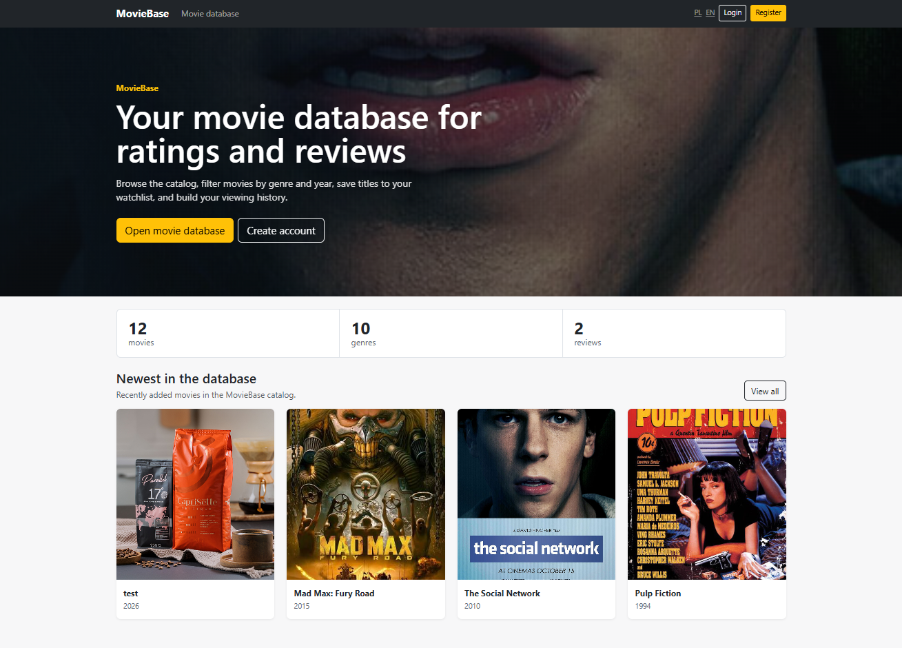
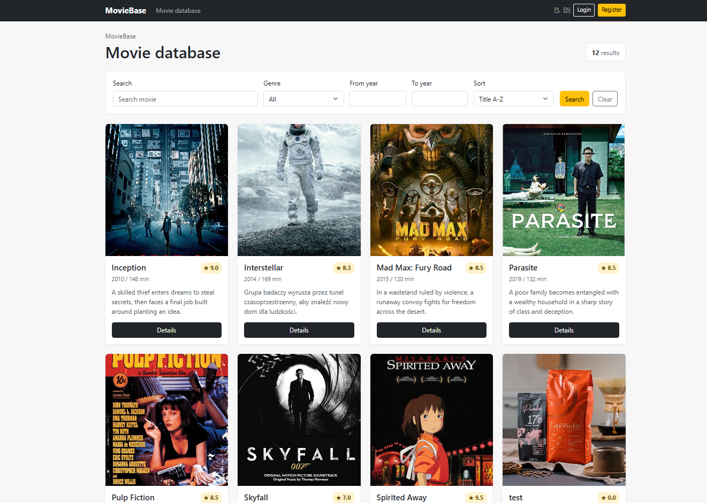
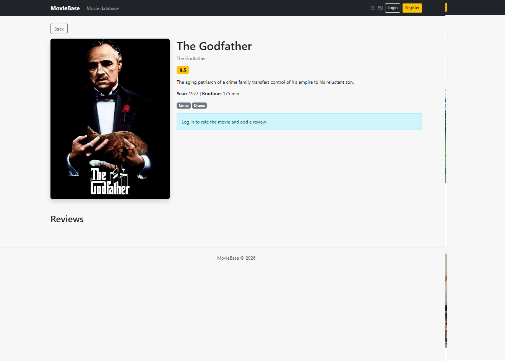
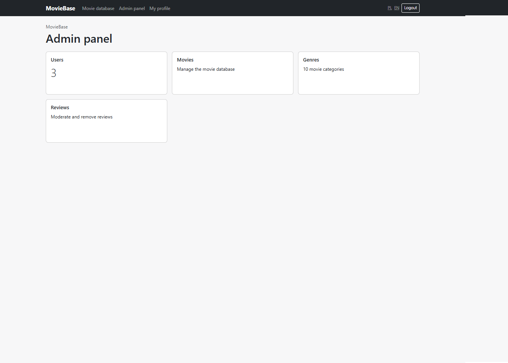

# MovieBase

MovieBase is a Spring Boot web application for browsing a movie database, filtering and sorting titles, rating movies, writing reviews, and managing a personal watchlist.

## Screenshots

Store project screenshots in `docs/screenshots/` and reference them from this README, for example:






## Tech Stack

- Java
- Spring Boot
- Spring MVC
- Spring Security
- Spring Data JPA / Hibernate
- Thymeleaf
- Bootstrap 5
- PostgreSQL
- Maven

## Features

- User registration and login
- Session-based authentication with Spring Security
- `ADMIN` and `USER` roles
- BCrypt password hashing
- Movie database with posters, descriptions, release year, runtime, and genres
- Movie search, filtering, sorting, and pagination
- Movie rating system
- User reviews
- User watchlist
- Admin panel for managing movies, genres, and reviews
- Poster upload in the admin panel
- Polish and English interface translations
- Server-side rendering with Thymeleaf

## Running the Application

Create a PostgreSQL database:

```sql
CREATE DATABASE moviebase;
```

Update the database credentials in:

```text
src/main/resources/application.properties
```

Run the application:

```bash
mvn spring-boot:run
```

The application is available at:

```text
http://localhost:8090
```

## Test Accounts

The following accounts are created automatically on first startup:

```text
admin@example.com / admin123
user@example.com / user123
```

## Deployment

The project is packaged as a `.war` file:

```bash
mvn clean package
```

The generated file from the `target/` directory can be deployed to Apache Tomcat 10.1+.
